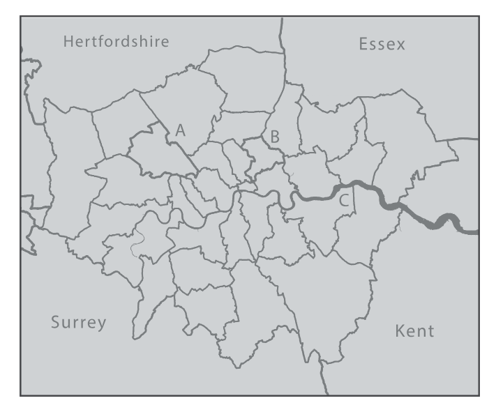
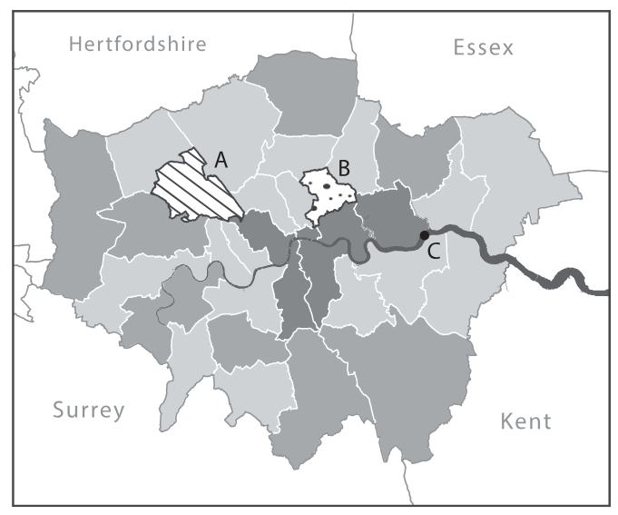

# The Map Layout and Visual Hierarchy

## Map Elements

```{figure} ../resources/w11-img/map_elements_example.png
:label:
:alt:
:align: center

Example of map elements. [source: ESRI](https://mgimond.github.io/Spatial/good-map-making-tips.html)
```

- Title should be easily identifiable as the map’s title through its size and positioning. Sub-titles are best in a smaller type size.

- Legend is a graphic guide that should comprise symbols, including colours, styles and patterns, which are not necessarily familiar to or known by the reader. A well-designed map should involve minimal reference to the legend.

- Insets allow the cartographer to show areas at a more detailed scale or to reposition features that would have otherwise ‘fallen’ just off the sheet to make best use of the available page and keep the main mapping at the most appropriate scale. They may also include an overview of where the region is in a wider geographical context, known as a locator map.

- Charts and figures are common to thematic maps showing geostatistical or geo-numerical data. They should be included only if they add weight to the message of the map.

- North arrow or any other directional indicator is only required if the orientation is not obvious. Arrows with a clear and suitably long North-South line are easier to use than more decorative ones.

- Scalebar allows users to make measurements on the map and is a quick reference to size objects. It does not have to represent distance, for example it can represent travel time.

- Border is a line encasing the edges of the mapped area or a line framing the entire map layout. It is sometimes known as a neatline, a term also used for a finer border line that may form the outer part of a grid and may contain graticule intersections.

See [Layout, balance, and visual hierarchy in map design in "The Routledge Handbook of Mapping and Cartography"](https://www-taylorfrancis-com.libproxy1.nus.edu.sg/chapters/edit/10.4324/9781315736822-28/layout-balance-visual-hierarchy-map-design-christopher-wesson) for more details.


## Example of bad and improved maps
### Bad Map Example

- Legend color
- Legend range and numbers
- Location of source info
- North arrow (complicated)
- Scale bar (complicated and alignment)
- Inset map too large
- Info about the numbers

```{figure} ../resources/w11-img/example_bad_map.jpg
:label:
:alt:
:align: center

[source: Chapter 7 Good Map Making Tips](https://mgimond.github.io/Spatial/good-map-making-tips.html)
```


### Improved Map Example

- Replaced legend title with the description of the data column
- Simplified north arrow and scale bar
- Colours changed to divergent colormap, with the center value to be the median
- Smaller inset map, better emphasized of main map


```{figure} ../resources/w11-img/example_bad_map_improved.jpg
:label:
:alt:
:align: center

[source: Chapter 7 Good Map Making Tips](https://mgimond.github.io/Spatial/good-map-making-tips.html)
```


## Visual Hierarchy

About how people 'look' for information.


```{figure} ../resources/w11-img/visual_hierarchy.png
:label:
:alt:
:align: center

Designing visual (for web UI). [Source](https://clay.global/blog/web-design-guide/visual-hierarchy-web-design)
```


```{figure} ../resources/w11-img/what-is-visual-hierarchy-in-web-design.jpg
:label:
:alt:
:align: center

Visual design. [Source](https://wpdean.com/what-is-visual-hierarchy-in-web-design/)
```


### Size / Scale Hierarchy


```{figure} ../resources/w11-img/size_hierarchy.jpg
:label:
:alt:
:align: center

How size affect visual. [Source](https://admiral.digital/what-is-visual-hierarchy-and-why-is-it-important/)
```


```{figure} ../resources/w11-img/Scale-organizes-content-by-size.png
:label:
:alt:
:align: center

How size affect visual. [Source](https://visme.co/blog/visual-hierarchy/)
```


```{figure} ../resources/w11-img/Fonts-organize-design-01.png
:label:
:alt:
:align: center

How size of fonts affect visual. [Source](https://visme.co/blog/visual-hierarchy/)
```


### Colour

```{figure} ../resources/w11-img/colour_order.png
:label:
:alt:
:align: center

The order of colours. [Source](https://clay.global/blog/web-design-guide/visual-hierarchy-web-design)
```


```{figure} ../resources/w11-img/Color-and-contrast-draw-attention-and-create-harmony.png
:label:
:alt:
:align: center

How colour and contrast draw attention and create harmony. [Source](https://visme.co/blog/visual-hierarchy/)
```


:::{figure}
:label: colorBadImproved
:align: left

(bad-map)=


(improved-map)=


[Layout, balance, and visual hierarchy in map design in "The Routledge Handbook of Mapping and Cartography"](https://www.taylorfrancis.com/chapters/edit/10.4324/9781315736822-28/layout-balance-visual-hierarchy-map-design-christopher-wesson)
:::


```{figure} ../resources/w11-img/different_color_mapbox.png
:label:
:alt:
:align: center

[Screenshot from Mapbox Gallery, Community Templates](https://www.mapbox.com/gallery)
```


### Layout

#### How people read

```{figure} ../resources/w11-img/uiux_read_pattern.png
:label:
:alt:
:align: center

Reading pattern in UIUX. [Source](https://www.interaction-design.org/literature/topics/visual-hierarchy)
```


```{figure} ../resources/w11-img/uiux_read_pattern2.png
:label:
:alt:
:align: center

Reading pattern in UIUX. [Source](https://www.interaction-design.org/literature/topics/visual-hierarchy?srsltid=AfmBOopgpNcuvrThNqPlsGQEKeRgygYpwrRwQ2TpCL0EJ9K2v1OSIOl5)
```


#### Rule of Third

```{figure} ../resources/w11-img/rule_of_third.png
:label:
:alt:
:align: center

What is the rule of third. [Source](https://www.interaction-design.org/literature/article/the-rule-of-thirds-know-your-layout-sweet-spots)
```


```{figure} ../resources/w11-img/Greenland-Husky-Rule-of-Thirds.webp
:label:
:alt:
:align: center

What is the rule of third. [Source](https://www.capturelandscapes.com/the-rule-of-thirds-explained/)
```


```{figure} ../resources/w11-img/image-5-ruleofthrid-min.jpg
:label:
:alt:
:align: center

What is the rule of third. [Source](https://admiral.digital/what-is-visual-hierarchy-and-why-is-it-important/)
```


```{figure} ../resources/w11-img/poster_rule_of_thirds.png
:label:
:alt:
:align: center

Rule of third in poster design. [Source](https://www.artworkflowhq.com/resources/the-rule-of-thirds-in-graphic-design)
```


```{figure} ../resources/w11-img/rule_of_third_KevinsGinMapGRID.jpg
:label:
:alt:
:align: center

What is the rule of third. [Source](https://community.esri.com/t5/esri-training-blog/using-artistic-inspiration-for-cartographic/ba-p/903968)
```


```{figure} ../resources/w11-img/processed-image-5.png
:label:
:alt:
:align: center

What is the rule of third. [Source](https://community.esri.com/t5/esri-training-blog/using-artistic-inspiration-for-cartographic/ba-p/903968)
```


```{figure} ../resources/w11-img/processed-image-6.png
:label:
:alt:
:align: center

Example of rule of third in map. [Using tool](https://onlinephototools.com/image-tools/image-rule-of-thirds-grid-overlay-tool/). Map screen short on [Zoom Earth](https://zoom.earth/)
```


```{figure} ../resources/w11-img/processed-image-1.png
:label:
:alt:
:align: center

Example of rule of third in map. [Using tool](https://onlinephototools.com/image-tools/image-rule-of-thirds-grid-overlay-tool/).
```

```{figure} ../resources/w11-img/processed-image-3.png
:label:
:alt:
:align: center

Example of rule of third in map. [Using tool](https://onlinephototools.com/image-tools/image-rule-of-thirds-grid-overlay-tool/).
```


```{figure} ../resources/w11-img/processed-image-4.png
:label:
:alt:
:align: center

Example of rule of third in map. [Using tool](https://onlinephototools.com/image-tools/image-rule-of-thirds-grid-overlay-tool/).
```


```{figure} ../resources/w11-img/processed-image-2.png
:label:
:alt:
:align: center

Example of rule of third in map. [Using tool](https://onlinephototools.com/image-tools/image-rule-of-thirds-grid-overlay-tool/).
```

```{figure} ../resources/w11-img/processed-image-7.png
:label:
:alt:
:align: center

Example of rule of third in map. [Using tool](https://onlinephototools.com/image-tools/image-rule-of-thirds-grid-overlay-tool/).
```


#### Common Ratio


```{figure} ../resources/w11-img/common_aspect_ratios.png
:label:
:alt:
:align: center

Landscape.
```


```{figure} ../resources/w11-img/common_aspect_ratios2.png
:label:
:alt:
:align: center

Portrait.
```


### Spacing -


```{figure} ../resources/w11-img/Space-provides-balance-emphasis-and-movement.png
:label:
:alt:
:align: center

Spacing in design. [Source](https://visme.co/blog/visual-hierarchy/]
```


```{figure} ../resources/w11-img/whitespace.jpg
:label:
:alt:
:align: center

Spacing Definition. [Source](https://clay.global/blog/web-design-guide/visual-hierarchy-web-design]
```


```{figure} ../resources/w11-img/whitespace_google.png
:label:
:alt:
:align: center

White spacing in [Google](https://www.google.com/)
```


### Spacing - For Balance

```{figure} ../resources/w11-img/design_balance.png
:label:
:alt:
:align: center

Spacing for balance in a map. [Source](https://www.esri.com/arcgis-blog/products/arcgis-pro/mapping/design-principles-for-cartography)
```


```{figure} ../resources/w11-img/whitespace_NASA_artic.png
:label:
:alt:
:align: center

Example of spacing. [Source](https://earthobservatory.nasa.gov/images/152333/arctic-chill-sweeps-us)
```

```{figure} ../resources/w11-img/whitespace_OSM.png
:label:
:alt:
:align: center

Example of spacing. [A spatio-temporal analysis investigating completeness and inequalities of global urban building data in OpenStreetMap](https://www.nature.com/articles/s41467-023-39698-6))
```
