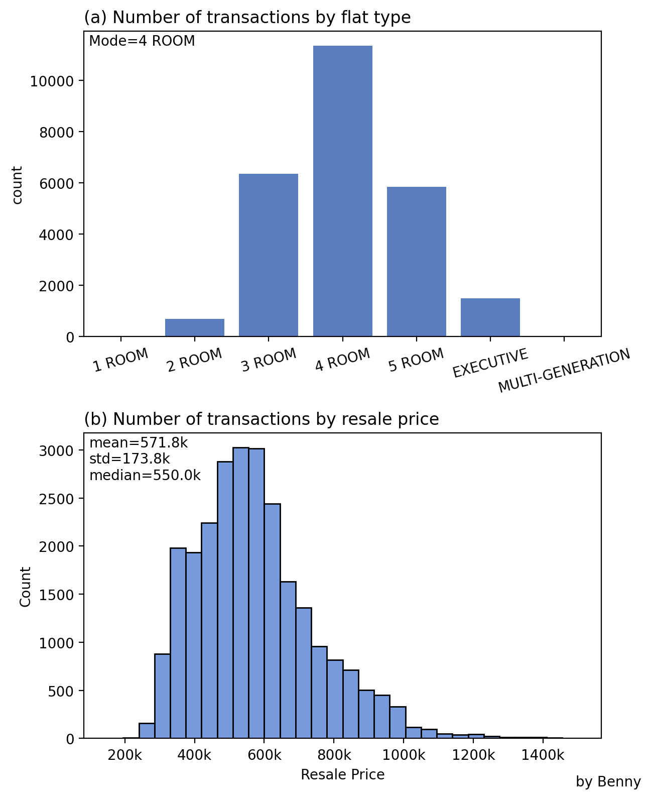
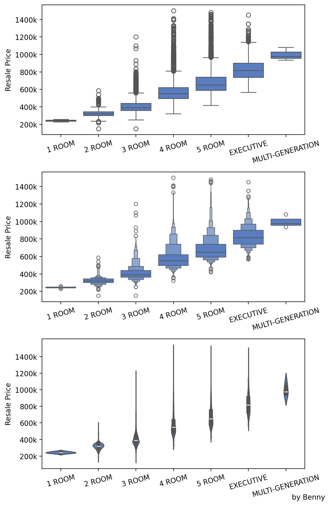
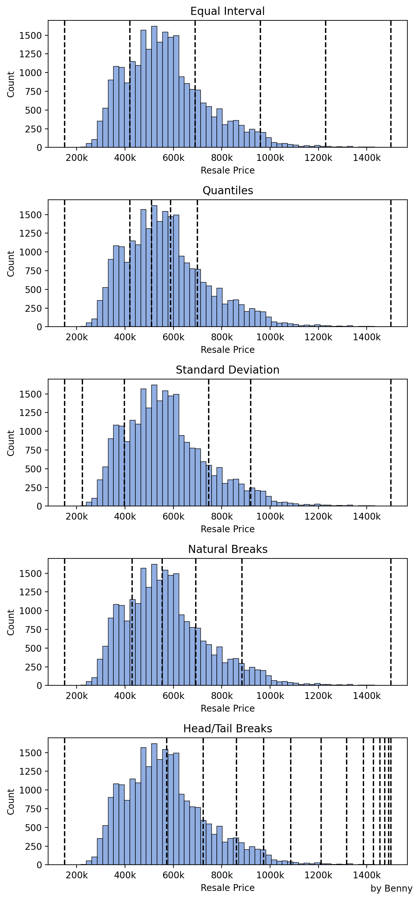

## GE5230 - week 2 - lab session

date: 2025-01-20

lecturer: Benny

Join Zoom Meeting (for lab session live view)
https://nus-sg.zoom.us/j/7105649562?pwd=aDhzOG5WYThwSjlVb2ZNZ3pJNDFPZz09

Meeting ID: 710 564 9562
Passcode: 610149

**Data**: hdb_data_2023.csv.xz

**Objective**: Generate the four figures below, follow the statements (after ordered numbers and before marks)

**Requirement**: Add your name and ID at the bottom right of each figure; put all figures  in one document (export to pdf); save the document with file name: studentID-name.pdf. Please also save the four figures in separate image file (.png) with dpi 200, the file names were provided below. 

**Be creative**: As long as your figures can capture the statement and contain a text label of your ID-name, all other elements are open for modification. 

**Submission**: Please submit the document pdf and figures (zip) together with next week assignment (2025/01/27), before 2025/02/02 23:59. 

1. Visualizing counts by category and prices (1 mark)

save as: studentID-name-w02-1.png

2. Compare the distribution between flat type (1 mark)

save as: studentID-name-w02-2.png

3. Compare the data transform methods (2 marks)

save as: studentID-name-w02-3.png

4. Compare the breaks (3 marks)

save as: studentID-name-w02-4.png