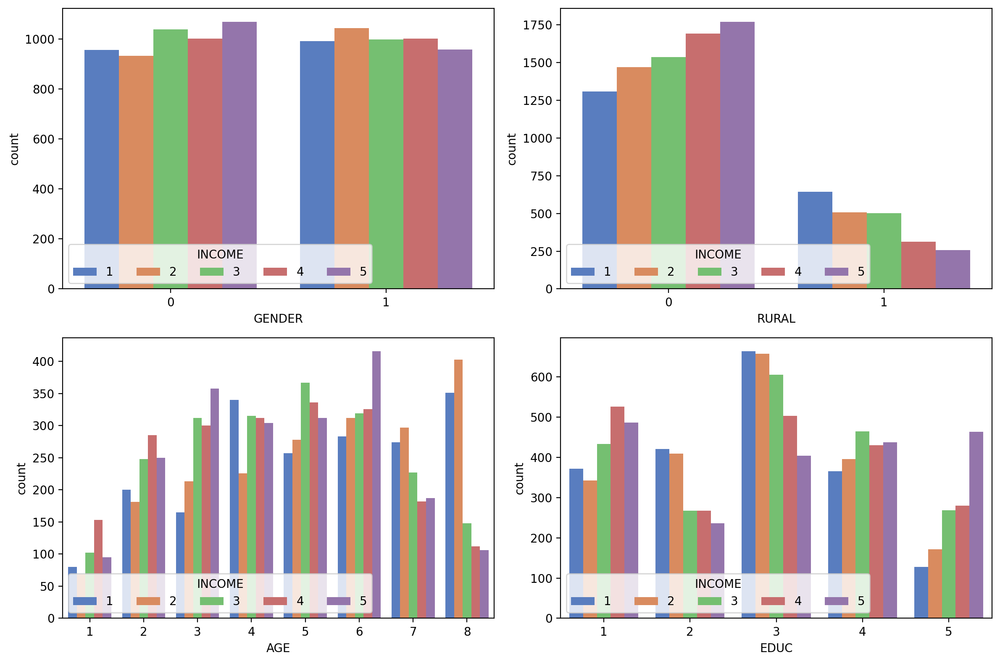

## GE5230 - week 3 - lab session

date: 2025-01-27

lecturer: Benny

## For Demo

Data: synthpop_BRNt.dat.gz 

Country (demo): Brunei

Script for reading file: read_synthpop_data.py

Related package manual: https://pingouin-stats.org/build/html/guidelines.html

## Assignment

Data source: https://dataverse.harvard.edu/dataset.xhtml?persistentId=doi:10.7910/DVN/KJC3RH 

Link with this Scientific Data Paper: https://doi.org/10.1038/s41597-024-03864-2

Data: Get a table from the data source (Harvard’s dataverse) for the country you choose (search by ISO code). **Please write down the country name and downloaded filename in the document.**

Resampling: Due to the computation cost, please resampling the synthetic data to get 10,000 individual.

**Objectives**: 

1. Generate a 4 subplots figure, containing the distribution of income/wealth (some country has either of these) by the four variables: gender (GENDER), is rural (RURAL), age (AGE), education (EDUC). See the demo below. Add studentID-name as what you did last week. (2 marks)
2. Run appropriate tests for the four variables vs. income/wealth to see if the categorical variables has significant impact. Arrange the results to a table format. (4 marks)
3. Provide reasonable academic guess to explain why those variables are significant/not significant for the country. (2 marks)

**Requirement**: Put all aforementioned results in one document, **together with last week’s assignment** (export to pdf); save the document with file name: studentID-name.pdf. Please also save the four figures (last week) and the figure for this week in separate image file (.png) with dpi 200, the file names were provided below. 

**Be creative**: As long as your figures can capture the statement and contain a text label of your ID-name, all other elements are open for modification. 

**Submission**: Please submit the document pdf and figures (zip) together with next week assignment (2025/01/27), before 2025/02/02 23:59. 

Demo figure

save as: studentID-name-w03.png

Demo of testing result:

