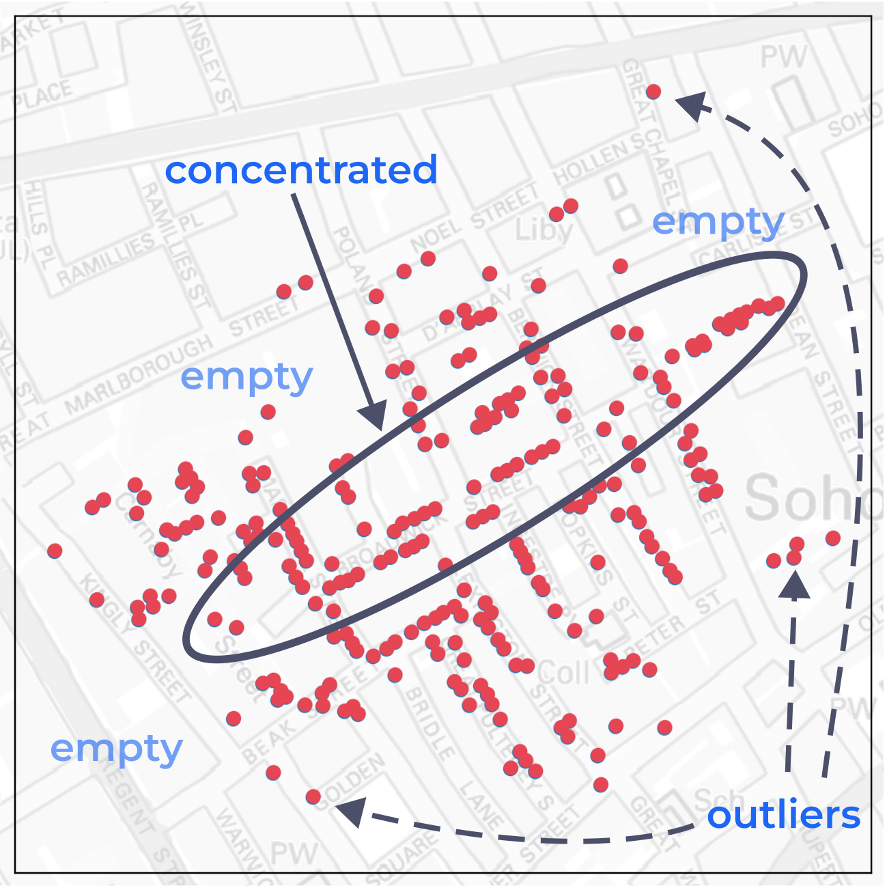
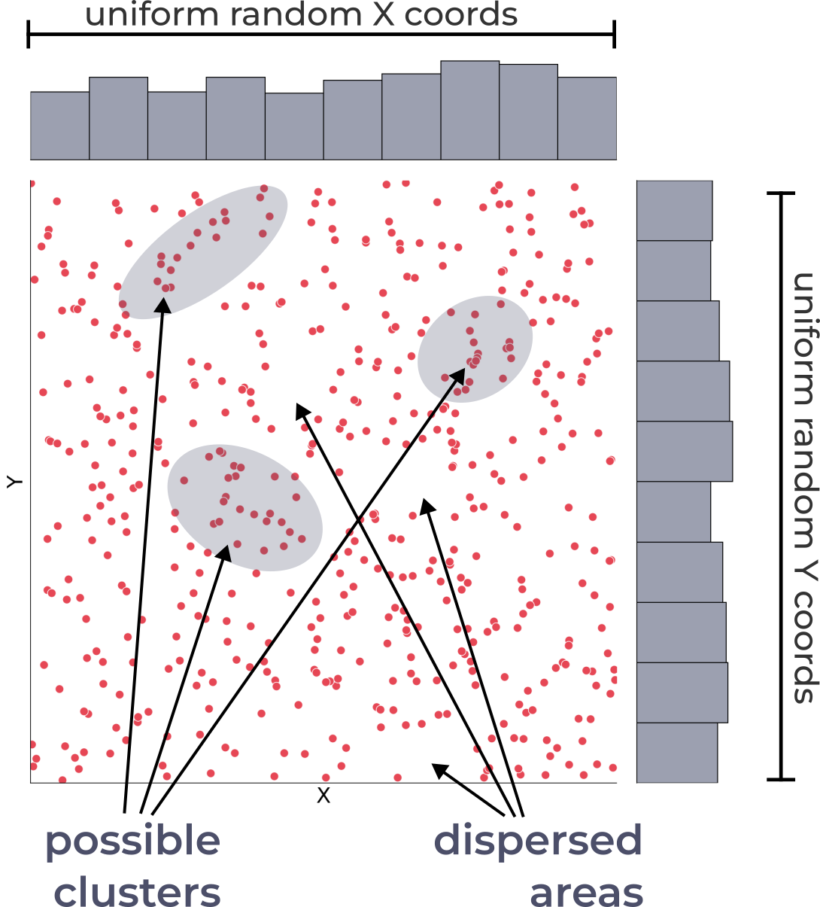
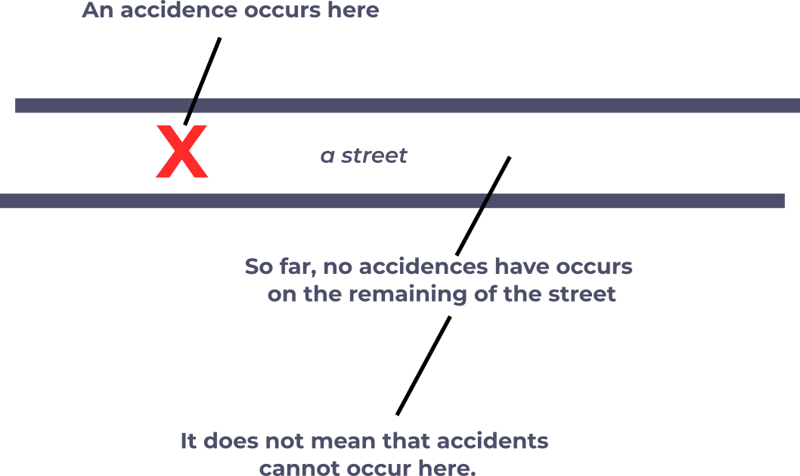
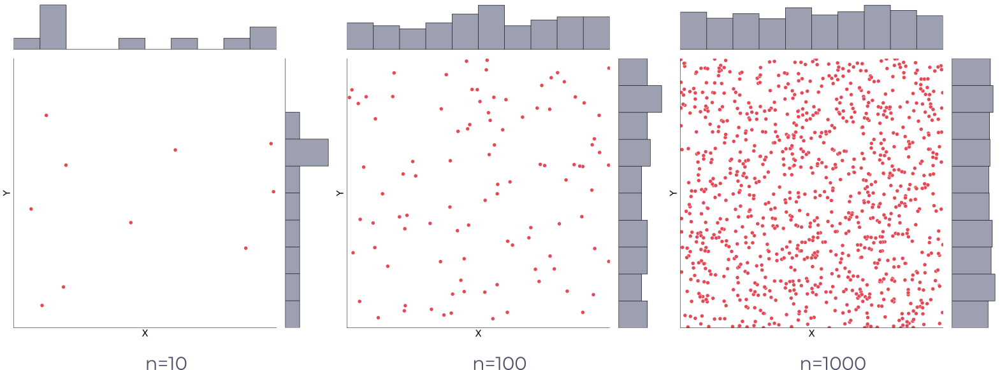

# Spatial Patterns and Complete Spatial Randomness

## What is Spatial Point Pattern? 

A bunch of points that form some patterns within a specific region.

.headnote.small.title-font.bold[John Snow's Cholera Death Incident Map]

].column[

]]

---
class: left, middle
.split-30[.column[
.headnote.small.title-font.bold[John Snow's Cholera Death Incident Map]

### What is Spatial Point Pattern? 

.red.bold[Visually speaking, what is the patterns here in the map?]

- How points are distributed?
- Some points .red[concentrated] at the middle.
- Some .red[outliers] are far from the cluster(s).
- Some empty spaces.

].column[

]]

---
class: left, middle

.split-30[.column[
### Key Aspects of Spatial Point Pattern
].column[
Spatial Point Pattern Analysis encompasses various methods and techniques that aim to:
- .bold[Explore the point locations]: This involves exploring the absolute locations/spaces of each point---where they are located. 
- .bold[Describe the points distribution]: This includes analyzing whether the points are distributed randomly, in clusters, or in a regular pattern, and determining the intensity or density of points within the study area.
- .bold[Explore the relationship between points]: This involves examining the interactions between points, such as the distance or orientation of points in relation to one another, and identifying any spatial correlation or dependence between points.
- .bold[Identify the spatial compositions and structures]: This focuses on determining the underlying spatial processes or factors that generate the observed point pattern and understanding the composition of different sub-patterns or structures within the overall pattern.

]]

---
class: center, top
### Three Major types of Point Pattern

.red.xkcd[How to differentiate clustered from random?]

---
class: left, middle

.split-50[.column[
.headnote.small.title-font.bold[Defining Random]

### Complete Spatial Randomness .smaller[(CSR)]

- The definition of "random" distribution
- The null hypothesis for identifying significant clustered pattern
- Not a regular distribution
- Can be spatially inhomogeneous, i.e., both clusters and dispersed areas exist
    - i.e., any observed clustering or disperse patterns could be attributed to chance alone
- .bold.red[Spatial Stationarity]
].column[

]]

---
class: left, middle

.split-30[.column[

### Spatial Stationarity

].column[

Stationarity is a key concept in spatial statistics and geostatistics, .red[referring to the property of a spatial process where the statistical properties remain constant across space (or time).] 

Stationarity is an important assumption in many spatial statistical methods, including Kriging, variogram analysis, and point process models. If a spatial process is not stationary, it may be necessary to apply transformations, detrending techniques, or local models to account for the spatial variability in the data before applying these methods.

Stationarity is a fundamental concept in spatial statistics that allows for the analysis and modeling of spatial processes .red[under the assumption of consistent statistical properties across space (or time)]. Understanding the stationarity of a spatial process is crucial for selecting appropriate analysis techniques and drawing valid conclusions from the data.

]]

---
class: left, middle
.split-50[.column[
### Stationarity on a street

].column[
Imagine we're analyzing the occurrence of accidents along a particular street. If an accident happens at a specific location on the street, and there are no accidents on the remaining parts of the street, it doesn't mean that those sections have zero probability of accidents. In the context of stationarity, we assume that the probability of accidents happening is constant across the entire street. Therefore, even if an accident occurred at one location, the probability of accidents happening on any other part of the street remains the same.

Stationarity implies that the underlying process generating the accidents is consistent across the street, and the observed distribution of accidents can be explained by random chance rather than any specific spatial factors or variations along the street.

]]

---
class: left, middle

.split-40[.column[
### Spatial Stationarity
#### Two main types of stationarity
- .red[Strict stationarity]
- Second-order stationarity
].column[
.bold[Strict stationarity (or strong stationarity)] 

A spatial process is considered strictly stationary .red[when its statistical properties], such as the mean, variance, and autocorrelation structure, .red[do not change with location (or time)]. In other words, the spatial process behaves the same regardless of where (or when) it is observed. For instance, if a spatial process is strictly stationary, .red[the probability of finding a specific value at a given location would be the same across the entire study area.]

]]

---
class: left, middle

.split-40[.column[
### Spatial Stationarity
#### Two main types of stationarity
- Strict stationarity
- .red[Second-order stationarity]
].column[
.bold[Second-order stationarity (or weak stationarity)]

A spatial process is considered second-order stationary when only its first and second-order moments (.red[mean, variance], and autocorrelation) are constant across space (or time), while higher-order moments may vary. This weaker form of stationarity is often sufficient for many spatial statistical analyses.
]]

---
class: center, middle

### Random Spatial Points

---
class: left, middle

.split-40[.column[
### Testing Strategy -- CSR
CSR represents a theoretical spatial distribution, and since its population parameters can be estimated accordingly, it serves as a useful basis for statistical testing and comparison with observed spatial patterns.
].column[
1. .bold[CSR as a Baseline]  
Complete Spatial Randomness (CSR) represents a scenario where points are distributed randomly and independently in space.
It serves as a baseline or null hypothesis for analyzing spatial point patterns.
2. .bold[Identifying Deviations from CSR]  
By comparing an observed spatial pattern to CSR, we can identify deviations that indicate potential clustering or dispersion.
Significant deviations suggest that the pattern is not random and may result from underlying spatial processes or interactions.
3. .bold[Quantifying Clustering]  
Comparing to CSR allows us to quantify the degree of clustering or dispersion in the observed pattern.
Statistical tests and measures, such as the quadrat count, nearest neighbor analysis and Ripley's K-function, can be used to assess the significance of clustering.
]]

---
class: center, middle

### How different it is compared to CSR?

---
class: left, middle

.split-40[.column[
### How different it is compared to CSR?

].column[
- In spatial statistics, CSR is the common null hypothesis. 
- Before we have enough proof to claim that a pattern is clustered, we have to assume .red[everything can happen by chance], i.e., random. 
- If the evidence suggests that the pattern is unlikely to have occurred by chance, only then we can .red[reject the null hypothesis] and conclude that the pattern is clustered (or dispersed).

]]
