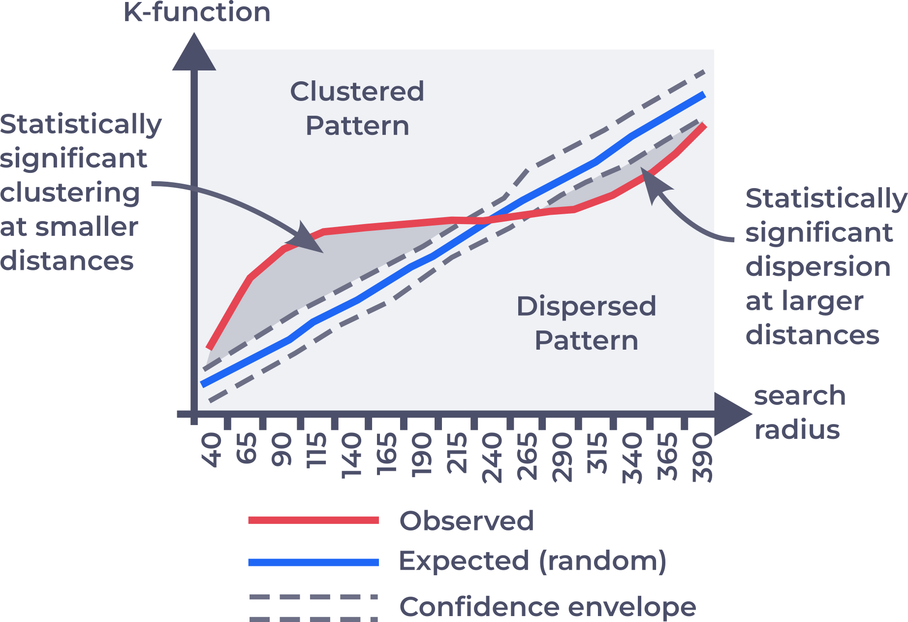
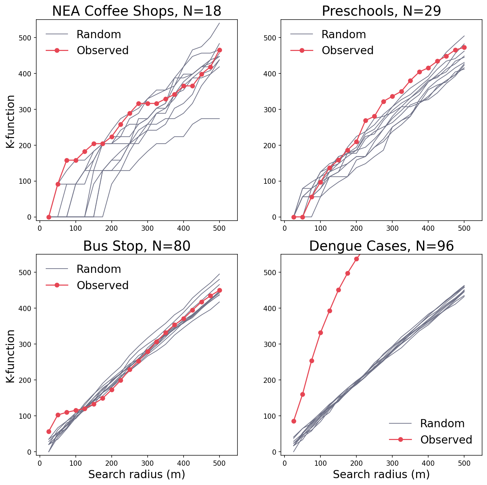
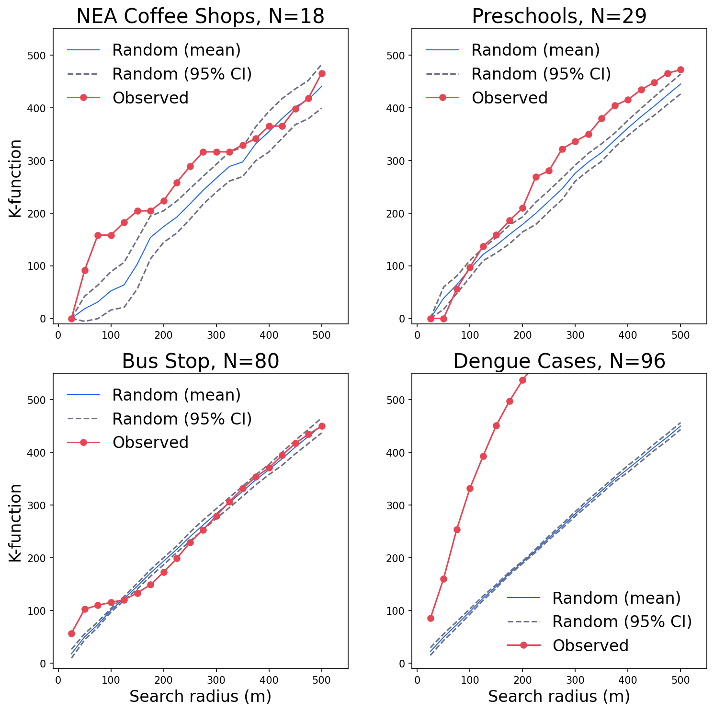

# Ripley's K-function
------
.square[]

.headnote.square.bold.x-large[Point Pattern I]

---
class: center, top
### The 2 Approaches

---
class: left, middle

.split-40[.column[
#### Bus Stops distribution

- Bus stops usually constructed in pairs, at both sides of a street.
- The nearest neighbor is at a short distance (opposite of street), but the second nearest may not.
- Is it a "real" clustered pattern?

].column[

]]

---
class: left, middle

.split-40[.column[
### Search Radius approach

The Ripley's K-function

- Generate a series of search radius (SR), from low to high
- Search for pairs of points fall within every SR
- The implication:
    - if a lot of pairs are found within a short SR: the points are clustered at this distance.

].column[
    
]]

---
class: left, middle

.split-30[.column[
### The Ripley's K-function
].column[
A common transformation of the K-function:
$$
L(d) = \sqrt{\frac{A \times \text{pairs}_d }{\pi n(n-1)}}
$$

$$
\text{pairs}\_d = \sum\_{i=1}^n \sum\_{j=1, j\neq i}^n w\_{ij}
$$

- $L(d)$: the k-function value at search radius $d$
- $\text{pairs}_d$: the number of pairs of points with distance less than $d$
- $w_{ij}$: equal to 1 if non-weighted; weighting for edge-correction
- $A$: Area of study
- $n$: total number of points
- $n(n-1)$: total number of all pairs

.smaller[More info: https://pro.arcgis.com/en/pro-app/3.1/tool-reference/spatial-statistics/h-how-multi-distance-spatial-cluster-analysis-ripl.htm]
]]

---
class: left, middle

.split-40[.column[
### Testing of K-functions

- How high is high enough to be considered as clustered?
- To compare them with CSR, Monte Carlo Simulation can be used

].column[
    
]]

---
class: left, middle

.split-40[.column[
### Testing of K-functions

- How high is high enough to be considered as clustered?
- To compare them with CSR, Monte Carlo Simulation can be used
- For demonstration: 10 random patterns are generated

].column[
    
]]

---
class: left, middle

.split-40[.column[
### Testing of K-functions

- How high is high enough to be considered as clustered?
- To compare them with CSR, Monte Carlo Simulation can be used
- For demonstration: 10 random patterns are generated
- Calculate 95% Confidence envelop

.small[see [ESRI](https://pro.arcgis.com/en/pro-app/3.1/tool-reference/spatial-statistics/h-how-multi-distance-spatial-cluster-analysis-ripl.htm) for more details]

].column[
    
]]

---
class: center, top

.split-50[.column[
.headnote.title-font.small.bold[Spatial Point Pattern]

Nearest Neighbor Analysis
].column[

Ripley's K-function
]]

---
class: left, middle

.split-30[.column[
### Summary
#### Repley's K-function
].column[
- Purpose:
Ripley's K function is a tool used to analyze spatial point patterns, helping researchers understand the spatial relationships among events or objects in a given study area.

- Functionality:
The K function estimates the expected number of points within a given distance from a randomly chosen point, providing insights into clustering, dispersion, or randomness in the spatial pattern.

- Key features:
    - The K function can be plotted as a function of distance to visualize changes in spatial interactions at different scales.
    - It can be compared with theoretical models, such as complete spatial randomness (CSR), to assess deviations from expected patterns.

]]
