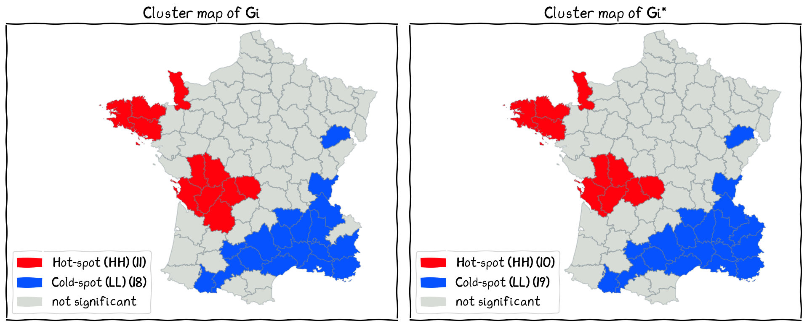

# Getis-Ord G statistics
------
.square[General G .dot[] Local Gi]

.headnote.square.bold.x-large[Areal Pattern II]

---
class: left, middle
.split-60[.column[
### Spatial Autocorrelation metrics and their Local versions
].column[

- Moran's I and Local Moran's I

- Geary's C and Local Geary's C

- .red[General G statistics and Gi; G and Gi*]
]]

---
class: left, middle

### Three things to notice in next slide

- the difference between 'stars': with star means $j$ can equal to $i$

- $x\_i \times x\_j$

- The lower part (denominator) is a kind of standardizig process to control the range of the resulting values.

---
class: left, middle

### Getis-Ord General G
$$\text{global} = a . [\sum_i \text{component}(i)]$$

.split-50[.column[
#### Global version
General G:
$$
\text{G} = \frac{\sum\_i \sum\_{j\neq  i} w\_{ij} x\_i x\_j }{\sum\_i\sum\_{j\neq  i} x\_i x\_j}
$$

General G*:

$$
\text{G}^{\*} = \frac{\sum\_i \sum\_j w\_{ij} x\_i x\_j }{\sum\_i\sum\_j x\_i x\_j}
$$

].column[
#### Local version
Gi:
$$
\text{G}\_i = \frac{\sum\_{j\neq i}w\_{ij}x\_j}{\sum\_{j\neq i}x\_j}
$$

Gi*:

$$
\text{G}\_{i}^{\*} = \frac{\sum\_{j}w\_{ij} x\_j}{\sum\_{j} x\_j}
$$

]]

---
class: left, middle
.split-30[.column[
### The three measures

].column[
#### Moran's I
- focus on $(x\_i - \bar{x})(x\_j - \bar{x})$ (deviation from the mean value)
- .red[large positive] value (I>0): spatial clusters (HH or LL)
- .red[large negative] value (I<0): spatial outliers (HL or LH)
- near zero (I=0): random

#### Geary's C
- focus on $(x\_i - x\_j)^2$ (squared differences)
- .red[small] value (c<1): spatial clusters (HH or LL)
- .red[large] value (c>1): spatial outliers (HL or LH)
- near 1 (c=1): random

#### Getis-Ord G\*
- focus on $x\_i \times x\_j$ (the intensity of values in local neighborhoods to the global average)
- .red[large] value (G\* > mean(G\*)): hot-spot (HH)
- .red[small] value (G\* < mean(G\*)): cold-spot (LL)
- near mean(G\*): random
]]

---
class: center, middle

### Significance Maps

---
class: center, middle

### Cluster Maps

---
class: center, middle, inverse

## Closing Remarks
------
.square[LISA .dot[] Local Moran's I .dot[] Geary's C and Local Geary .dot[] Getis-Ord G and Gi]

.headnote.square.bold.x-large[Areal Pattern II]

---
class: left, middle
.split-30[.column[
### Recap of this lecture
].column[
- LISA
- Local Moran's I
- Geary's C and Local Geary's C
- Getis-Ord G(\*) Statistics and Gi(\*)
]]

---
class: left, middle

.split-30[.column[
### Choosing the appropriate method(s)
There are so many different methods and equations for spatial autocorrelation, which one should I use?
].column[

.bold[Aim of Visualisation]
- If you only want to detect high and low clustering phenomena, the .red[Getis-Ord G statistics] could be sufficient.
- If your data are expected to have a common middle value (e.g., mean), and you aim to detect hot-spots and cold-spots in relation to this middle value, .red[Moran's I] is ideal.
- If you want to detect places with similar values (not necessarily compared to the middle value), .red[Geary's C] is the way to go.

.bold[Scale Sensitivity]
- .red[Moran's I] is more sensitive to larger-scale spatial patterns, as every value is compared to the global mean.
- .red[Geary's C] is better at detecting local, smaller-scale variations, since it calculates the differences rather than similarity between values.
- .red[Getis-Ord G] statistic is also more sensitive to large-scale spatial patterns. The range of the product obtained by multiplying a pair of values implies that it focuses on global high and global low value pairs.

.bold[Comparison with Previous Studies]
- If you want to compare your results with other research in your field, choose a method that is commonly used in those studies for consistency and ease of comparison.

]]

### What we have learnt so far

